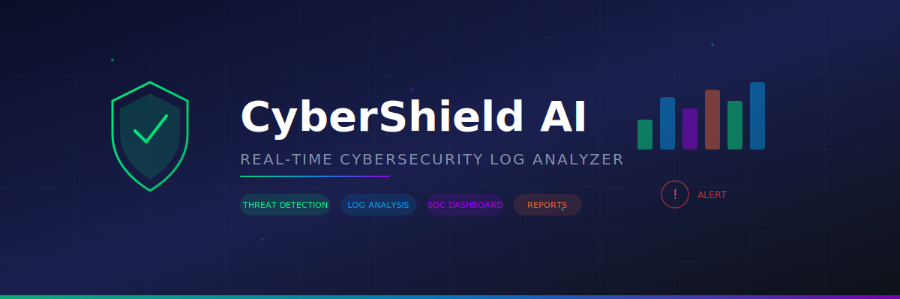
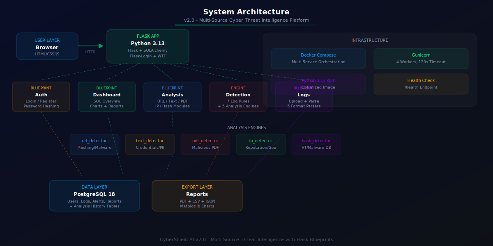
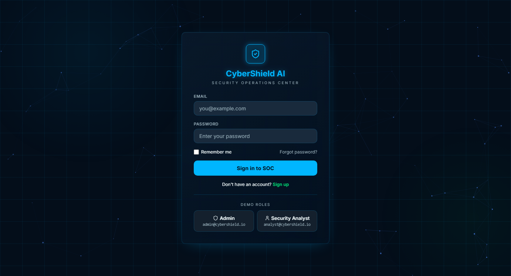
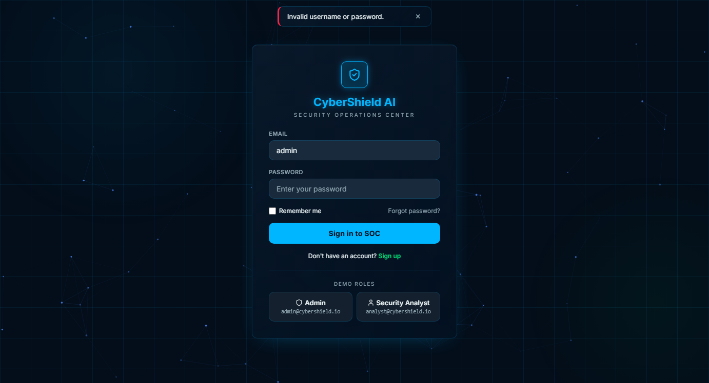

<p align="center">
  
</p>

<h1 align="center">CyberShield AI</h1>

<p align="center">
  <strong>Analyze. Detect. Defend.</strong>
</p>

<p align="center">
  <strong>AI-Powered Multi-Source Cyber Threat Analysis Platform</strong>
</p>

<p align="center">
  
  
  
  
  
  
</p>

<p align="center">
  
  
  
</p>

---

## Overview

**CyberShield AI** is a production-inspired, AI-powered cybersecurity web application that analyzes multiple types of security inputs, detects suspicious activities, identifies common cyber attacks, and visualizes security events through an interactive **Security Operations Center (SOC) Dashboard**.

Originally built as a Log Analysis Tool (v1.0), CyberShield AI **v2.0** has been upgraded into a comprehensive **Multi-Source Cyber Threat Analysis Platform** capable of analyzing URLs, text messages, PDF files, IP addresses, and file hashes — all from a single unified interface.

> Built by **Kotturu Vishnu Sree Vidya** — Computer Science Student, Full-Stack Developer & Cybersecurity Enthusiast.
>
> **GitHub:** [https://github.com/VishnuSreeVidya/CyberShield-AI](https://github.com/VishnuSreeVidya/CyberShield-AI)

---

## Key Features

### Analysis Capabilities

| Feature | Description | Detection Method |
|---------|-------------|-----------------|
| **Log Analysis** | Upload server logs for automatic threat detection | Regex pattern matching + threshold analysis |
| **URL Analysis** | Analyze URLs for phishing, malware, and suspicious patterns | HTTPS check, keyword analysis, brand impersonation detection |
| **Text Analysis** | Detect phishing, scam, and spam in emails/SMS/messages | Pattern matching, keyword scoring, linguistic analysis |
| **PDF Analysis** | Inspect PDF metadata, embedded URLs, and suspicious content | Metadata parsing, JavaScript detection, exploit signature matching |
| **IP Address Analysis** | Classify IPs as public/private/reserved with threat assessment | IPv4/IPv6 validation, blacklist checking, ASN lookup |
| **File Hash Analysis** | Validate MD5/SHA1/SHA256 against threat databases | Format validation, demo malicious hash DB lookup, algorithm strength |

### Platform Features

| Feature | Description |
|---------|-------------|
| **SOC Dashboard** | Interactive charts, real-time stats, and analysis distribution |
| **Authentication** | Secure login/register with role-based access control |
| **Analysis History** | View, search, and filter all previous analyses |
| **Report Export** | Download reports as CSV, JSON, or PDF |
| **Threat Detection Engine** | 7 log analysis rules + 5 specialized analysis engines |
| **Dark Glassmorphism UI** | Professional dark-themed interface with glass effects |

---

## Threat Detection Engine

### 7 Log Analysis Rules

| # | Rule | Method | Severity |
|---|------|--------|----------|
| 1 | **Failed Login Detection** | Regex pattern matching | Medium |
| 2 | **Brute Force Attack** | Threshold-based (5+ failed logins from same IP) | High |
| 3 | **SQL Injection** | Pattern matching (UNION SELECT, DROP TABLE, etc.) | Critical |
| 4 | **Cross-Site Scripting (XSS)** | Pattern matching (script tags, event handlers) | High |
| 5 | **Directory Traversal** | Pattern matching (../, %2e%2e, encoded variants) | High |
| 6 | **Port Scanning** | Heuristic (15+ unique endpoints from same IP) | Medium |
| 7 | **DoS (Denial of Service)** | Threshold-based (100+ requests from same IP) | Critical |

### 5 Analysis Modules

| Module | What It Analyzes | Output |
|--------|-----------------|--------|
| **URL Detector** | HTTPS status, URL length, suspicious keywords, IP-based URLs, phishing indicators, brand impersonation, URL shorteners | Threat Level, Risk Score, Findings, Recommendations |
| **Text Detector** | Phishing patterns, scam patterns, spam indicators, suspicious words, excessive caps/exclamation, embedded URLs | Classification, Confidence Score, Risk Level, Recommendations |
| **PDF Detector** | File metadata, author, creation date, page count, embedded URLs, suspicious JavaScript keywords, exploit tool signatures | Threat Level, Risk Score, Findings, Recommendations |
| **IP Detector** | IPv4/IPv6 validation, public/private/reserved classification, loopback, multicast, link-local, known malicious ranges | Threat Level, Risk Score, IP Type, Recommendations |
| **Hash Detector** | MD5/SHA1/SHA256 format validation, demo malicious hash database lookup, algorithm strength assessment | Threat Status, Risk Score, Findings, Recommendations |

---

## Technology Stack

### Backend

| Technology | Purpose |
|------------|---------|
| **Python 3.13** | Core language |
| **Flask 3.1** | Web framework |
| **SQLAlchemy 2.0** | ORM for database operations |
| **Flask-Login** | Session management and authentication |
| **Flask-WTF** | Form handling with CSRF protection |
| **PostgreSQL 18** | Production database |
| **Werkzeug** | Password hashing and security utilities |

### Frontend

| Technology | Purpose |
|------------|---------|
| **HTML5 + Jinja2** | 20 template files |
| **Custom CSS** | 1100+ lines of glassmorphism dark-theme styling |
| **JavaScript ES6+** | Client-side interactivity |
| **Chart.js** | Interactive data visualizations |
| **Lucide Icons** | UI icon system |
| **Canvas API** | Animated particle backgrounds |

### Analysis Engines

| Technology | Purpose |
|------------|---------|
| **Python regex** | URL, text, PDF, IP pattern detection |
| **ipaddress (stdlib)** | IP classification and validation |
| **hashlib (stdlib)** | Hash validation and comparison |
| **urllib.parse** | URL parsing and analysis |

### Data Processing

| Technology | Purpose |
|------------|---------|
| **Pandas** | CSV/JSON data processing |
| **Regular Expressions** | Apache log parsing, threat pattern matching |
| **Matplotlib** | PDF report generation with charts |

### Infrastructure

| Technology | Purpose |
|------------|---------|
| **Docker** | Containerization |
| **Docker Compose** | Multi-service orchestration |
| **Gunicorn** | Production WSGI server (4 workers) |
| **pytest** | Testing framework with coverage |

---

## System Architecture

<p align="center">
  
</p>

The application follows a **modular Flask Blueprint architecture** with clear separation of concerns:

```
User Request → Flask App → Blueprint Router → Detection Engine → PostgreSQL → Response
                      ↓
              Analysis Engine (URL/Text/PDF/IP/Hash)
                      ↓
              Results + Risk Score → Dashboard Visualization
```

---

## Project Structure

```
CyberShield-AI/
│
├── app/
│   ├── analysis/                  # Multi-source analysis routes
│   │   ├── __init__.py            # Blueprint registration
│   │   └── routes.py              # 8 routes: choose, url, text, pdf, ip, hash, history, detail
│   │
│   ├── auth/                      # Authentication routes & forms
│   │   ├── __init__.py
│   │   ├── forms.py
│   │   └── routes.py
│   │
│   ├── dashboard/                 # SOC Dashboard routes
│   │   ├── __init__.py
│   │   └── routes.py
│   │
│   ├── detection/                 # Threat detection engines
│   │   ├── engine.py              # 7 log analysis rules
│   │   ├── url_detector.py        # URL phishing/malware detection
│   │   ├── text_detector.py       # Text phishing/scam/spam detection
│   │   ├── pdf_detector.py        # PDF metadata & threat analysis
│   │   ├── ip_detector.py         # IP classification & threat assessment
│   │   └── hash_detector.py       # Hash validation & threat database lookup
│   │
│   ├── logs/                      # Log upload & management routes
│   │   ├── __init__.py
│   │   └── routes.py
│   │
│   ├── models/                    # SQLAlchemy models (10 total)
│   │   ├── __init__.py
│   │   ├── user.py                # User accounts
│   │   ├── log_entry.py           # Uploaded log entries
│   │   ├── alert.py               # Generated alerts
│   │   ├── report.py              # Generated reports
│   │   ├── analysis_history.py    # Analysis session tracking
│   │   ├── url_analysis.py        # URL analysis results
│   │   ├── text_analysis.py       # Text analysis results
│   │   ├── pdf_analysis.py        # PDF analysis results
│   │   ├── ip_analysis.py         # IP analysis results
│   │   └── hash_analysis.py       # Hash analysis results
│   │
│   ├── routes/                    # API endpoints & landing routes
│   │   ├── __init__.py
│   │   ├── api.py
│   │   └── routes.py
│   │
│   ├── static/
│   │   ├── css/                   # Custom glassmorphism stylesheet
│   │   └── js/                    # Chart.js + animated particle canvas
│   │
│   └── templates/                 # Jinja2 templates (20 files)
│       ├── base.html              # Main layout with sidebar
│       ├── index.html             # Landing page
│       ├── auth/                  # Login, Register
│       ├── dashboard/             # Dashboard, Alerts, Reports, Settings
│       ├── logs/                  # Upload, List, Detail, Threats
│       └── analysis/              # Choose, URL, Text, PDF, IP, Hash, History, Detail
│
├── assets/images/                 # Project screenshots & diagrams
├── screenshots/                   # Application screenshots
├── tests/                         # pytest test suite
├── config.py                      # Flask configuration
├── run.py                         # Application entry point
├── requirements.txt               # Python dependencies
├── Dockerfile                     # Docker image definition
├── docker-compose.yml             # Production deployment
├── docker-entrypoint.py           # Docker startup script
├── .env                           # Environment variables (not committed)
└── .gitignore
```

---

## Installation & Setup

### Prerequisites

- Python 3.13+
- PostgreSQL 14+
- Git

### Clone the Repository

```bash
git clone https://github.com/VishnuSreeVidya/CyberShield-AI.git
cd CyberShield-AI
```

### Create a Virtual Environment

**Windows (PowerShell)**

```powershell
python -m venv venv
.\venv\Scripts\Activate.ps1
```

**Linux / macOS**

```bash
python3 -m venv venv
source venv/bin/activate
```

### Install Dependencies

```bash
pip install -r requirements.txt
```

### Configure Environment Variables

Create a `.env` file in the project root:

```env
SECRET_KEY=your-secret-key-here
DB_USER=postgres
DB_PASSWORD=your_password
DB_HOST=localhost
DB_PORT=5432
DB_NAME=cybershield_ai
```

### Database Setup

Create a PostgreSQL database:

```sql
CREATE DATABASE cybershield_ai;
```

### Run the Application

```bash
python run.py
```

The application will be available at:

```
http://127.0.0.1:5000
```

### Docker Deployment

```bash
docker compose up --build
```

---

## Database Schema Overview

### Existing Tables (v1.0)

| Table | Columns |
|-------|---------|
| **users** | id, username, email, password_hash, role, created_at |
| **logs** | id, timestamp, ip_address, http_method, request_url, status_code, user_agent, raw_log, uploaded_at |
| **alerts** | id, log_id, source_ip, attack_type, severity, description, detected_at |
| **reports** | id, report_name, report_type, generated_at |

### New Tables (v2.0)

| Table | Columns |
|-------|---------|
| **analysis_history** | id, user_id, analysis_type, threat_level, risk_score, summary, created_at |
| **url_analyses** | id, history_id, url, is_https, url_length, has_suspicious_keywords, is_ip_based, phishing_indicators, findings, recommendations |
| **text_analyses** | id, history_id, input_text, classification, confidence_score, is_phishing, is_scam, is_spam, suspicious_words, findings, recommendations |
| **pdf_analyses** | id, history_id, filename, file_size, author, creation_date, page_count, embedded_urls, suspicious_keywords, findings, recommendations |
| **ip_analyses** | id, history_id, ip_address, is_public, is_valid, is_reserved, ip_type, findings, recommendations |
| **hash_analyses** | id, history_id, hash_value, hash_type, is_valid_format, threat_status, findings, recommendations |

---

## REST API Endpoints

| Endpoint | Method | Description |
|----------|--------|-------------|
| `/api/dashboard/stats` | GET | Aggregate log, alert, and analysis counts |
| `/api/dashboard/alerts_by_type` | GET | Alerts grouped by attack type |
| `/api/dashboard/recent_alerts` | GET | Last 10 alerts |
| `/api/dashboard/timeline` | GET | Hourly attack counts (24h) |
| `/api/dashboard/top_ips` | GET | Top 10 attacking IPs |
| `/health` | GET | Health check endpoint |

---

## Application Routes

| Route | Description |
|-------|-------------|
| `/` | Landing page (redirects to dashboard) |
| `/auth/login` | Login page |
| `/auth/register` | Registration page |
| `/dashboard/` | SOC Dashboard |
| `/dashboard/alerts` | All alerts view |
| `/dashboard/reports` | Reports & export page |
| `/dashboard/settings` | Profile & password settings |
| `/analysis/` | Choose analysis type |
| `/analysis/url` | URL analysis |
| `/analysis/text` | Text analysis |
| `/analysis/pdf` | PDF analysis |
| `/analysis/ip` | IP address analysis |
| `/analysis/hash` | File hash analysis |
| `/analysis/history` | Analysis history with search/filter |
| `/analysis/history/<id>` | Analysis detail view |
| `/logs/` | Log explorer |
| `/logs/upload` | Upload log files |
| `/logs/threats` | Threat-filtered log view |
| `/logs/<id>` | Log detail with alerts |

---

## Application Workflow

### Log Analysis Flow

```
User Login → Upload Log File → Auto-Detect Format → Parse Entries
    → Run 7 Threat Detection Rules → Generate Alerts → Display Results
```

1. User logs in to the application
2. Uploads a server log file (`.txt`, `.csv`, `.json`, `.log`)
3. System auto-detects the log format (Apache combined/common, syslog, JSON, CSV)
4. Parses each log entry, extracting: Timestamp, IP Address, HTTP Method, URL, Status Code, User Agent
5. Stores parsed logs in PostgreSQL
6. Runs 7 threat detection rules against each entry
7. Generates alerts with severity levels (Critical / High / Medium / Low)
8. Displays results on the SOC dashboard

### Multi-Source Analysis Flow

```
Navigate to New Analysis → Select Type → Enter Input → Run Engine
    → Generate Risk Score → Store Results → Display Findings
```

1. User navigates to **New Analysis** from the sidebar
2. Selects an analysis type (URL, Text, PDF, IP, or Hash)
3. Enters input (URL, pastes text, uploads PDF, enters IP/hash)
4. System runs specialized detection engine
5. Results stored in database with threat level and risk score
6. Results displayed with findings, recommendations, and details
7. All analyses tracked in **Analysis History** with search and filter

---

## Screenshots

### Home Page

<p align="center">
  
</p>

---

### Login Page

<p align="center">
  
</p>

---

### Register Page

<p align="center">
  
</p>

---

### Dashboard

<p align="center">
  
</p>

---

### Choose Analysis Type

<p align="center">
  
</p>

---

### Log Analysis

<p align="center">
  
</p>

---

### URL Analysis

<p align="center">
  
</p>

---

### Text Analysis

<p align="center">
  
</p>

---

### PDF Analysis

<p align="center">
  
</p>

---

### IP Address Analysis

<p align="center">
  
</p>

---

### File Hash Analysis

<p align="center">
  
</p>

---

### Analysis Results

<p align="center">
  
</p>

---

### Threat Reports

<p align="center">
  
</p>

---

### Analysis History

<p align="center">
  
</p>

---

### Profile Page

<p align="center">
  
</p>

---

## Future Enhancements

| Enhancement | Description |
|-------------|-------------|
| **VirusTotal Integration** | Real-time hash and URL reputation checking via VirusTotal API |
| **Threat Intelligence APIs** | Integration with MISP, AlienVault OTX, and other threat feeds |
| **Real-Time Monitoring** | WebSocket-based live log monitoring and instant alerts |
| **AI Chat Assistant** | Natural language interface for querying threat data |
| **Email Alerts** | Automated email notifications for critical threats |
| **IP Geolocation** | GeoIP2 integration for IP location mapping |
| **Machine Learning** | ML-based anomaly detection for unknown threats |
| **REST API Docs** | Swagger/OpenAPI documentation for all endpoints |
| **Multi-Tenant Support** | Organization-level isolation and management |
| **PDF Text Extraction** | PyPDF2 integration for full PDF content analysis |

---

## Testing

```bash
pytest tests/ -q
```

### Test Coverage

| Test File | Coverage |
|-----------|----------|
| `test_models.py` | User, LogEntry, Alert, Report models |
| `test_auth.py` | Registration, login, logout, validation |
| `test_parsers.py` | Format detection, all 5 parsers |
| `test_detection.py` | All 7 detection rules + orchestrator |
| `test_routes.py` | Dashboard, logs, API, exports |

---

## Version History

| Version | Date | Changes |
|---------|------|---------|
| **v2.0** | July 2026 | Multi-source analysis platform: URL, Text, PDF, IP, Hash analysis modules. Upgraded dashboard, analysis history with search/filter, 6 new database tables, 5 detection engines |
| **v1.0** | July 2026 | Initial release: Log analysis tool with 7 threat detection rules, SOC dashboard, report export |

---

## Contributing

Contributions are welcome! Please follow these steps:

1. **Fork** the repository
2. **Create** a feature branch (`git checkout -b feature/amazing-feature`)
3. **Commit** your changes (`git commit -m 'Add amazing feature'`)
4. **Push** to the branch (`git push origin feature/amazing-feature`)
5. **Open** a Pull Request

### Development Guidelines

- Follow PEP 8 style guide for Python code
- Write tests for new features
- Update documentation for API changes
- Use meaningful commit messages

---

## License

This project is licensed under the **MIT License**. See the [LICENSE](LICENSE) file for details.

---

## Author

**Kotturu Vishnu Sree Vidya**

Computer Science Student | Full-Stack Developer | Cybersecurity Enthusiast

<p align="center">
  
</p>

<p align="center">
  <strong>Analyze. Detect. Defend.</strong>
</p>
