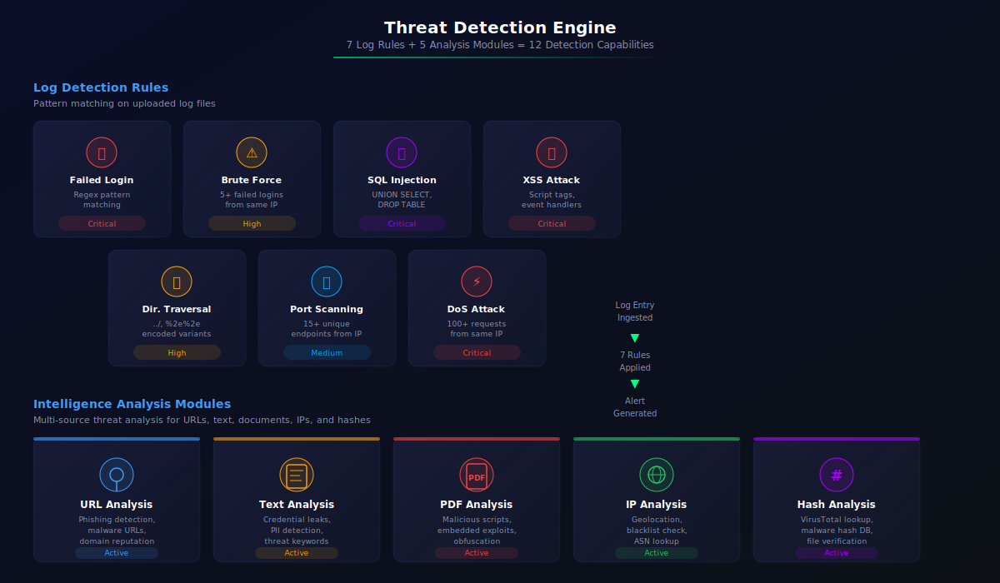
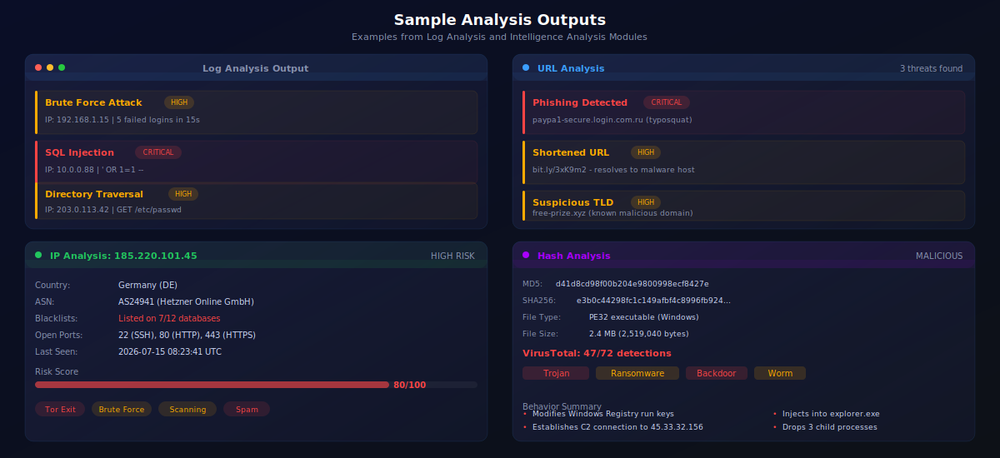

<p align="center">
  
</p>

<h1 align="center">CyberShield AI</h1>

<p align="center">
  <strong>Real-Time Cyber Security Log Analyzer & Threat Detection Platform</strong>
</p>

<p align="center">
  
  
  
  
  
  
</p>

---

## Overview

CyberShield AI is a production-inspired cybersecurity web application that analyzes server log files, detects suspicious activities, identifies common cyber attacks, and visualizes security events through an interactive **Security Operations Center (SOC) Dashboard**.

Built by **Kotturu Vishnu Sree Vidya** — Computer Science Student, Full-Stack Developer & Cybersecurity Enthusiast.

> **GitHub:** [https://github.com/VishnuSreeVidya/CyberShield-AI](https://github.com/VishnuSreeVidya/CyberShield-AI)

---

## Dashboard Preview

<p align="center">
  
</p>

---

## Features

### Authentication System
- User Registration with validation (username uniqueness, email, password matching)
- Secure Login with Werkzeug password hashing
- Role-Based Access Control (default: `analyst`)
- Profile settings (update username/email, change password)
- Demo role quick-login buttons (Admin / Security Analyst)

### Log Management
- Upload server log files (`.log`, `.txt`, `.csv`, `.json`)
- Automatic format detection (Apache combined/common, syslog/auth, JSON, CSV)
- Smart fallback parsing when format is ambiguous
- Extracts: Timestamp, IP Address, HTTP Method, Request URL, Status Code, User Agent
- Paginated log explorer with detail views
- Threat-filtered view showing only logs with detected threats

### Threat Detection Engine (7 Detection Rules)

<p align="center">
  
</p>

| # | Rule | Method | Severity |
|---|------|--------|----------|
| 1 | **Failed Login Detection** | Regex pattern matching | Critical |
| 2 | **Brute Force Attack** | Threshold-based (5+ failed logins from same IP) | High |
| 3 | **SQL Injection** | Pattern matching (UNION SELECT, DROP TABLE, etc.) | Critical |
| 4 | **Cross-Site Scripting (XSS)** | Pattern matching (script tags, event handlers) | Critical |
| 5 | **Directory Traversal** | Pattern matching (../, %2e%2e, encoded variants) | High |
| 6 | **Port Scanning** | Heuristic (15+ unique endpoints from same IP) | Medium |
| 7 | **DoS (Denial of Service)** | Threshold-based (100+ requests from same IP) | Critical |

### SOC Dashboard
- **8 Stat Cards**: Total Logs, Total Alerts, Failed Logins, Brute Force, SQL Injection, XSS, Critical Threats, High-Risk IPs
- **4 Interactive Charts** (via Chart.js):
  - Attack Timeline (line chart, last 24 hours)
  - Attack Types Distribution (doughnut chart)
  - Top Attacking IPs (horizontal bar chart)
  - Severity Distribution (vertical bar chart)
- **Live Alert Feed** with severity badges, source IPs, and timestamps
- All chart data fetched via JSON API endpoints

### Report Export
- **CSV Export**: All alerts as downloadable CSV
- **JSON Export**: All alerts as downloadable JSON
- **PDF Export**: Multi-page PDF report with matplotlib charts (Attack Type Breakdown, Severity Distribution, Top Attacking IPs, Recent Alerts table)

### Security
- CSRF protection via Flask-WTF
- Password hashing (Werkzeug `generate_password_hash` / `check_password_hash`)
- SQLAlchemy ORM (prevents SQL injection in queries)
- Environment variables via `.env` (secrets not hardcoded)
- Input validation on forms and file uploads
- File extension whitelist (`.log`, `.txt`, `.csv`, `.json`)
- `@login_required` on all protected routes

---

## Login Page

<p align="center">
  
</p>

---

## Sample Input / Output

<p align="center">
  
</p>

### Input: Server Log File

```text
192.168.1.15 - - [08/Jul/2026:10:20:10] "POST /login HTTP/1.1" 401
192.168.1.15 - - [08/Jul/2026:10:20:14] "POST /login HTTP/1.1" 401
192.168.1.15 - - [08/Jul/2026:10:20:18] "POST /login HTTP/1.1" 401
192.168.1.15 - - [08/Jul/2026:10:20:22] "POST /login HTTP/1.1" 401
192.168.1.15 - - [08/Jul/2026:10:20:25] "POST /login HTTP/1.1" 401
```

### Output: Detected Threat

```text
Threat Detected

Attack Type: Brute Force
Source IP:   192.168.1.15
Severity:    High
Attempts:    5 Failed Logins (threshold: 5)
```

---

## Tech Stack

### Backend
| Technology | Purpose |
|---|---|
| **Python 3.13** | Core language |
| **Flask 3.1** | Web framework |
| **SQLAlchemy 2.0** | ORM |
| **Flask-Login** | Session management |
| **Flask-WTF** | Form handling with CSRF |
| **PostgreSQL 18** | Database |

### Frontend
| Technology | Purpose |
|---|---|
| **HTML5 + Jinja2** | 10 template files |
| **Custom CSS** | 1037 lines of glassmorphism dark-theme |
| **JavaScript ES6+** | Client-side interactivity |
| **Chart.js** | Interactive data visualizations |
| **Lucide Icons** | UI icon system |
| **Canvas API** | Animated particle backgrounds |

### Data Processing
| Technology | Purpose |
|---|---|
| **Pandas** | CSV/JSON data processing |
| **Regular Expressions** | Apache log parsing |
| **Matplotlib** | PDF report generation |

### Infrastructure
| Technology | Purpose |
|---|---|
| **Docker** | Containerization |
| **Docker Compose** | Multi-service orchestration |
| **Gunicorn** | Production WSGI server (4 workers) |

---

## System Architecture

<p align="center">
  
</p>

---

## Project Structure

```text
CyberShield-AI/
│
├── app/
│   ├── auth/               # Authentication routes & forms
│   ├── dashboard/          # SOC Dashboard routes
│   ├── detection/          # Threat detection engine (7 rules)
│   ├── logs/               # Log upload & management routes
│   ├── models/             # SQLAlchemy models (User, LogEntry, Alert, Report)
│   ├── routes/             # API endpoints & landing routes
│   ├── services/           # (reserved for future services)
│   ├── static/
│   │   ├── css/            # Custom glassmorphism stylesheet (1037 lines)
│   │   └── js/             # Chart.js + animated particle canvas
│   ├── templates/          # Jinja2 templates (10 files)
│   └── utils/              # Log parsers & utilities
│
├── tests/                  # pytest test suite (95 tests)
│   ├── test_auth.py        # 11 tests: registration, login, logout
│   ├── test_detection.py   # 20 tests: all 7 detection rules
│   ├── test_models.py      # 13 tests: ORM models
│   ├── test_parsers.py     # 22 tests: format detection & parsers
│   └── test_routes.py      # 29 tests: dashboard, logs, API, exports
│
├── assets/images/          # Project screenshots & diagrams
├── config.py               # Flask configuration
├── run.py                  # Application entry point
├── requirements.txt        # Python dependencies
├── Dockerfile              # Docker image definition
├── docker-compose.yml      # Production deployment
├── docker-entrypoint.py    # Docker startup script
├── .env                    # Environment variables
└── .gitignore
```

---

## Installation

### Clone the Repository

```bash
git clone https://github.com/VishnuSreeVidya/CyberShield-AI.git
cd CyberShield-AI
```

### Create a Virtual Environment

**Windows (PowerShell)**

```powershell
python -m venv venv
.\venv\Scripts\Activate.ps1
```

**Linux / macOS**

```bash
python3 -m venv venv
source venv/bin/activate
```

### Install Dependencies

```bash
pip install -r requirements.txt
```

---

## PostgreSQL Configuration

Create a PostgreSQL database:

```sql
CREATE DATABASE cybershield_ai;
```

Create a `.env` file in the project root:

```env
SECRET_KEY=your-secret-key-here
DB_USER=postgres
DB_PASSWORD=your_password
DB_HOST=localhost
DB_PORT=5432
DB_NAME=cybershield_ai
```

---

## Running the Application

```bash
python run.py
```

The application will be available at:

```
http://127.0.0.1:5000
```

### Docker Deployment

```bash
docker compose up --build
```

---

## How It Works

1. **User logs in** to the application via the authentication system
2. **Uploads a server log file** (`.txt`, `.csv`, `.json`, `.log`)
3. The system **auto-detects the log format** (Apache combined/common, syslog, JSON, CSV)
4. **Parses each log entry**, extracting: Timestamp, IP Address, HTTP Method, URL, Status Code, User Agent
5. **Stores parsed logs** in PostgreSQL
6. **Runs 7 threat detection rules** against each entry (regex + threshold-based)
7. **Generates alerts** for suspicious activities with severity levels (Critical / High / Medium / Low)
8. **Displays results** on the SOC dashboard with interactive charts and a live alert feed

---

## JSON API Endpoints

| Endpoint | Description |
|---|---|
| `GET /api/dashboard/stats` | Aggregate log and alert counts |
| `GET /api/dashboard/alerts_by_type` | Alerts grouped by attack type |
| `GET /api/dashboard/recent_alerts` | Last 10 alerts |
| `GET /api/dashboard/timeline` | Hourly attack counts (24h) |
| `GET /api/dashboard/top_ips` | Top 10 attacking IPs |
| `GET /health` | Health check endpoint |

---

## Running Tests

```bash
pytest tests/ -q
```

95 tests covering:

| Test File | Tests | Coverage |
|---|---|---|
| `test_models.py` | 13 | User, LogEntry, Alert, Report models |
| `test_auth.py` | 11 | Registration, login, logout, validation |
| `test_parsers.py` | 22 | Format detection, all 5 parsers |
| `test_detection.py` | 20 | All 7 detection rules + orchestrator |
| `test_routes.py` | 29 | Dashboard, logs, API, exports |

---

## Future Enhancements

- Real-Time Log Monitoring (WebSocket)
- Email / Slack Notifications
- IP Geolocation (GeoIP)
- Threat Intelligence Feed Integration
- Machine Learning-Based Anomaly Detection
- REST API Documentation (Swagger/OpenAPI)
- Multi-Tenant Support

---

## Contributing

Contributions are welcome.

1. Fork the repository
2. Create a feature branch (`git checkout -b feature/amazing-feature`)
3. Commit your changes (`git commit -m 'Add amazing feature'`)
4. Push your branch (`git push origin feature/amazing-feature`)
5. Open a Pull Request

---

## License

This project is licensed under the MIT License.

---

## Author

**Kotturu Vishnu Sree Vidya**

Computer Science Student | Full-Stack Developer | Cybersecurity Enthusiast

<p align="center">
  
</p>
